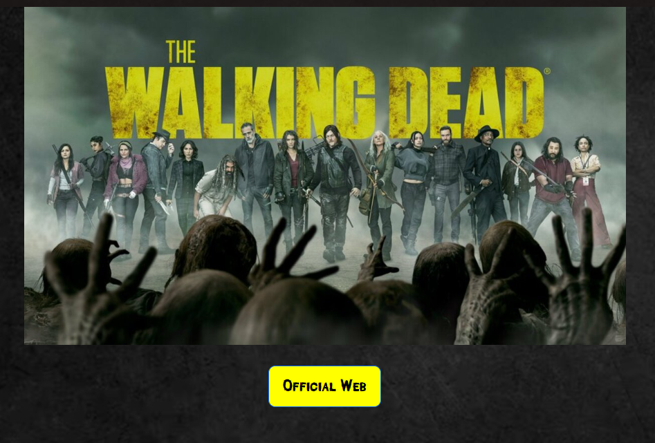
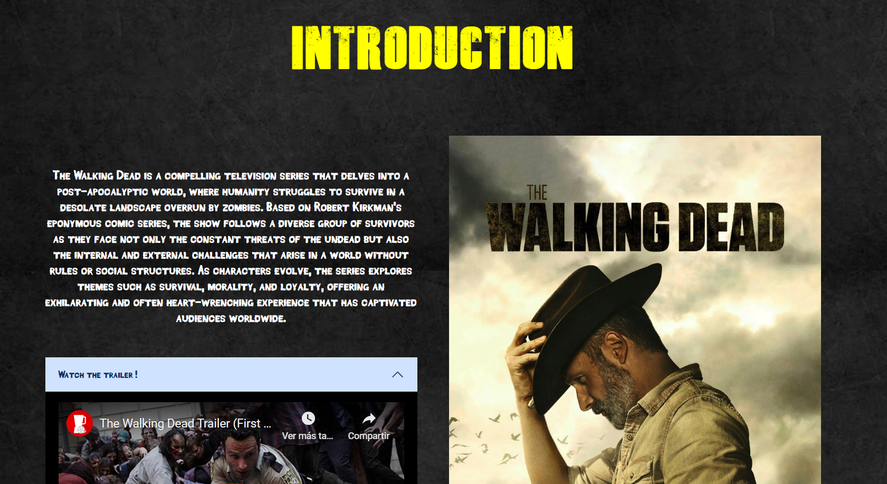
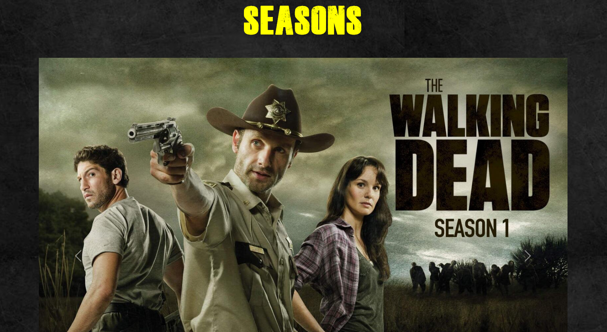
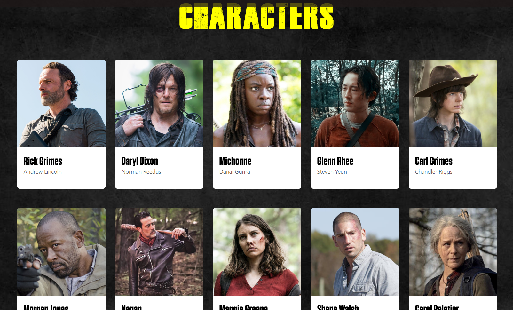
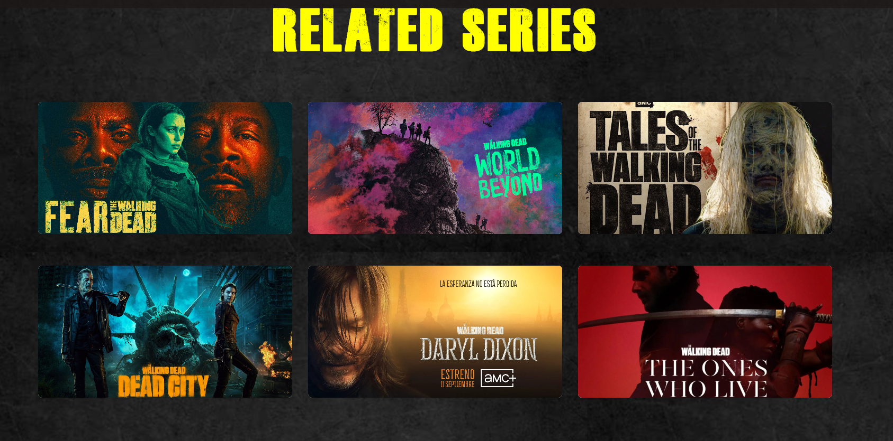
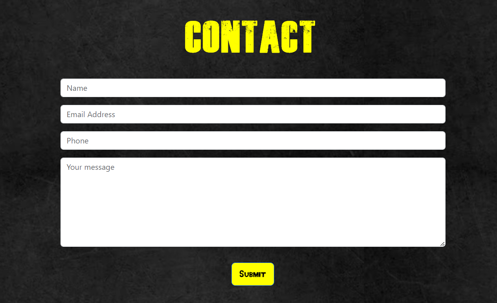
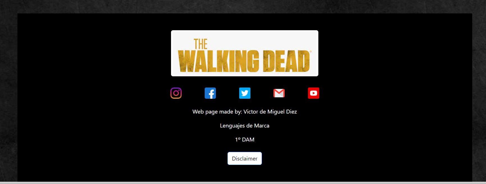

<h1>Memoria del proyecto de Lenguajes de Marcas - 1º DAM</h1>
<h2>Walking Dead - A tribute site</h2>
<h2>Indice</h2>
<ul>
  <li><a href="#introduccion">Introducción</a></li>
  <li><a href="#motivacion">Motivación</a></li>
  <li><a href="#estructura">Estructura</a></li>
  <li><a href="#estilo">Estilo</a></li>
</ul>

<h2 id="introduccion">Introducción</h2>

Trabajo realizado en clase por: Víctor de Miguel Díez

Proyecto de web de 2ª evaluación de Lenguajes de Marcas

Febrero de 2024 

Licencia CC-BY

<h2 id="motivacion">Motivación</h2>

Este tema lo he escogido porque he visto esta serie y me interesa bastante por lo que lo veia un buen tema para hacer una pagina de "fan site", ademas de que tiene bastante contenido como para hacer una pagina.

<h2 id="estructura">Estructura</h2>

La web está dividida en  6 secciones:

<ul>
  <li>Hero Section</li>  
  <li>Introducción</li>
  <li>Temporadas</li>
  <li>Personajes</li> 
  <li>Series Relacionadas</li> 
  <li>Contacto</li> 
  <li>Footer</li>
</ul>

<h3>Hero Section</h3>

He utilizado una imagen de la portada de la serie de Walking Dead en la cual aparecen varios de sus personajes.  
Debajo de ella he colocado un boton que te redirige a la pagina web official de la serie.

<h3>Introducción</h3>

He hecho una pequeña introduccion de la serie donde cuento un poco de su historia y un pequeño resumen.  
Debajo de esto he añadido un accordion el cual despliega un trailer de la serie (tomado del canal de youtube de: Trailer Blend) y tambien despliega un poco mas de informacion relacionada con la serie. A la derecha de todo esto he puesto una imagen del protagonista de la serie usando columnas para ello. 

<h3>Temporadas</h3>

He añadido una galeria de imagenes con un Slideshow en la que aparecia una imagen de cada temporada

<h3>Personajes</h3>

He dispuesto un grid de 5 columnas en las cual he hecho unas cards en las que muestro algunos de los personajes principales de la serie con su nombre y el nombre de su actor

<h3>Series relacionadas</h3>

He dispuesto otro grid de 3 columnas donde mustro la imagen de las portadas de series que estan relacionadas con la serie de The Walking Dead. 

<h3>Contacto</h3>

He añadido un cuestionario donde puedes escribir tu nombre un email un telefono y un mensaje. Todo esto tiene una validación para revisar que la informacion añadida en cada apartado sea la correcta. Debajo de esto he añadido un botor para enviar el formulario, aunque aun no hace nada. 

<h3>Footer</h3>

En la footer he añadido una imagen con el nombre de la serie, debajo de esto he puesto iconos de las redes sociales con las cuales se me puede contactar (iconos tomados de Flaticon).  Despues he añadido un poco de informacion de la pagina junto con un disclaimer.

<h2 id="estilo">Estilo de la página</h2>
<h3>Paleta de colores</h3>

He utilizado una paleta de colores con temas de la propia serie, que son un tipo de naranja y uno de amarillo, que con deribados y variables de estos colores (añadiendo también colores blancos y negros) se llega a obtener una buena paleta de colores. 

<h3>Tipografías</h3>

Para los titulos he usado una tipografía (tomada de 1001 fonts) que es bastante parecida a la que aparece en la portada de la serie, y para los textos normales, botones y navbar he utilizado otras dos tipografía (también tomada de 1001 fonts) que me parecian bastante aptas para lo que necesitaba la pagina.

<h3>Imágenes</h3>

Las imágenes que he utilizado en mi página web las he elegido ya que creo que estan bastante relacionada con la serie de The Walking Dead contando con fotos de sus temporadas, personajes, y otros iconos de esta serie dandole bastante estilo a mi página.   Las imágenes las he tomado de las siguientes paginas: Fox España, thewalkingdeadshop, thewalkingdead, amc, Flaticon, Wikipedia, Pinterest. 

<h3>Videos</h3>

He utilizado un video del trailer de la temporada 1 de la serie en la introducción el cual lo he tomado del canal de youtube de: Trailer Blend. 

<h2 id="snippets">Code snippets</h2>

He utilizado los siguientes:

<ul>
  <li>Barra de navegación: tomada de w3Schools (https://www.w3schools.com/css/css_navbar.asp).</li>
  <li>Accordion: tomada de w3Schools "How to" (https://www.w3schools.com/howto/howto_js_accordion.asp).</li>
  <li>Slideshow: tomada de codepen.io (https://codepen.io/JyGProyectosWeb/pen/PNBRev).</li>
  <li>Cards: tomada de w3Schools.</li>
  <li>Ventana modal: he utilizado una ventana modal para hacer el disclaimer de mi pagina, tomada de w3Schools. </li>
</ul>